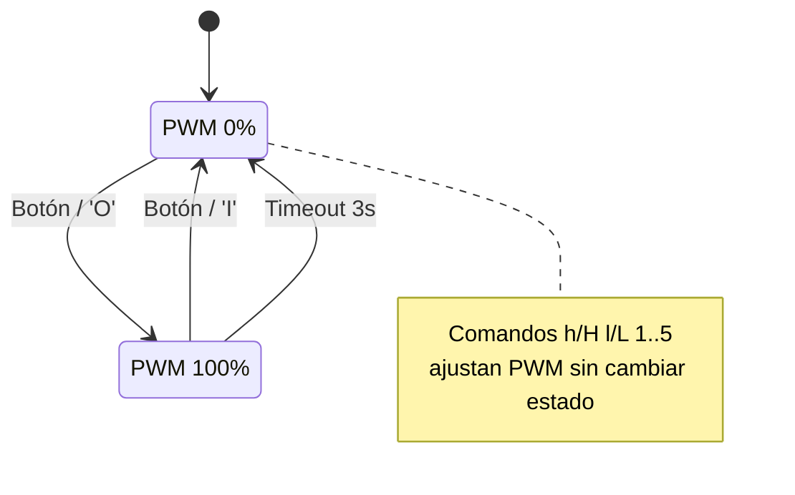
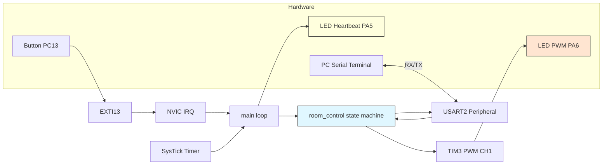

# 11. USER_MANUAL.md

## Manual de Usuario: Sistema de Control de Sala

**Universidad Nacional de Colombia - Sede Manizales**  
**Curso:** Estructuras Computacionales (4100901)

---

### 1. Introducción

El Sistema de Control de Sala es una aplicación embebida básica que simula el control de iluminación de una habitación. Utiliza un LED de estado (heartbeat) para indicar que el sistema está activo y un LED controlado por PWM para representar la intensidad de iluminación de la sala según su ocupación. La lógica se implementa totalmente mediante acceso directo a registros (C “bare metal”), sin usar HAL ni bibliotecas de alto nivel.

El usuario puede interactuar mediante: (a) un botón físico (PC13) que alterna el estado de ocupación y (b) comandos enviados por UART (USART2) desde un PC. El sistema apaga automáticamente la iluminación (PWM) tras un tiempo de inactividad (3 segundos) cuando la sala está ocupada.

### 2. Hardware Utilizado

| Componente | Uso | Pin / Interfaz |
|------------|-----|----------------|
| Placa Nucleo STM32L476RG | MCU ARM Cortex-M4 | - |
| LED Heartbeat (LD2) | Indica actividad del sistema | PA5 |
| LED PWM (Iluminación Sala) | Simula bombilla con brillo variable | PA6 (TIM3_CH1) |
| Botón Usuario (B1) | Genera evento de ocupación | PC13 (EXTI13) |
| UART a PC | Comunicación/Comandos | PA2 (TX), PA3 (RX), USART2 @115200 8N1 |
| Reloj interno HSI | Fuente de SysTick / periféricos | 4 MHz |

Nota: El README menciona un “LED externo encendido 3s” tras pulsación. En la implementación actual esa función se cumple usando el LED PWM (PA6) que se pone al 100% durante el período de ocupación y se apaga por timeout; no se configuró un LED digital separado adicional. El LED LD2 (PA5) se reserva para heartbeat.

### 3. Funcionalidades

#### 3.1 Heartbeat LED (PA5)
Parpadea cada 500 ms para indicar que el firmware se ejecuta correctamente y que el bucle principal no está bloqueado. Se implementa en `main.c` usando un contador de milisegundos incrementado por `SysTick_Handler`.

#### 3.2 Control de Ocupación por Botón (PC13)
Al presionar el botón:
* Si el estado es IDLE → pasa a OCCUPIED, fija PWM al 100%, registra timestamp y envía mensaje “Sala ocupada”.
* Si el estado es OCCUPIED → pasa a IDLE, fija PWM al 0% y envía “Sala vacía”.

El sistema aplica un timeout automático: si permanece en OCCUPIED 3000 ms, cambia a IDLE y apaga (duty 0%), enviando “Timeout: Sala vacía”.

#### 3.3 Comunicación UART (USART2)
Velocidad: 115200 baudios, 8 bits de datos, sin paridad, 1 bit de stop (8N1). Al iniciar envía: “Sistema de Control de Sala Inicializado!”. Cada comando recibido se procesa en la ISR (`USART2_IRQHandler`) y luego el bucle principal llama `room_control_on_uart_receive()`.

Comandos soportados:

| Comando | Acción | Mensaje UART | Cambia estado |
|---------|--------|--------------|----------------|
| `h` / `H` | PWM 100% | `PWM: 100%` | No |
| `l` / `L` | PWM 0% | `PWM: 0%` | No |
| `O` / `o` | Ocupado, PWM 100%, reinicia timeout | `Sala ocupada` | Sí (a OCCUPIED) |
| `I` / `i` | Idle, PWM 0% | `Sala vacía` | Sí (a ROOM_IDLE) |
| `1` | PWM 10% | `PWM: 10%` | No |
| `2` | PWM 20% | `PWM: 20%` | No |
| `3` | PWM 30% | `PWM: 30%` | No |
| `4` | PWM 40% | `PWM: 40%` | No |
| `5` | PWM 50% | `PWM: 50%` | No |
| Otro carácter | Eco como desconocido | `Comando desconocido: <c>` | No |

Observación: Los comandos numéricos disponibles llegan hasta 50%. Pueden ampliarse fácilmente para cubrir 60–100%.

#### 3.4 Control PWM (PA6 / TIM3_CH1)
Frecuencia configurada a 1 kHz (`tim3_ch1_pwm_init(1000)`). El duty cycle se ajusta escribiendo en `CCR1` (modo PWM1). El cálculo se realiza en `tim3_ch1_pwm_set_duty_cycle(percent)` tomando `ARR` como período. Rango válido 0–100%; el código previene valores mayores a 100.

### 4. Arquitectura del Sistema

#### 4.1 Módulos
* `rcc`: Habilita relojes de GPIO y periféricos (GPIOA/B/C, TIM3, USART2, SYSCFG).
* `gpio`: Configuración y acceso a pines (modos, lectura y escritura, alternate function).
* `systick`: Configura SysTick para generar ticks de 1 ms y obtener tiempo (`systick_get_ms`).
* `nvic`: Configura EXTI para el botón y habilita IRQs (EXTI15_10, USART2).
* `uart`: Inicialización de USART2 y funciones de envío/recepción.
* `tim`: Inicialización de TIM3 canal 1 en modo PWM y ajuste de duty cycle.
* `room_control`: Máquina de estados (IDLE/OCCUPIED), procesamiento de eventos, timeout.
* `main`: Orquestación: inicializa periféricos, bucle principal, heartbeat, despacho de eventos.
* `startup`: Vector de interrupciones y arranque del sistema.

#### 4.2 Flujo de Ejecución
1. Reset → Código de arranque configura stack y salta a `main`.
2. `peripherals_init()` habilita relojes y configura: PA5 (heartbeat), PC13 (botón), PA2/PA3 (UART), PA6 (PWM), SysTick, NVIC, TIM3, USART2.
3. `room_control_app_init()` establece duty inicial a 0% (estado inicial IDLE con iluminación apagada).
4. Se envía mensaje de bienvenida por UART.
5. Bucle infinito:
   * Actualiza heartbeat cada 500 ms.
   * Si `button_event == 1` → procesa pulsación.
   * Si `uart_event_char != 0` → procesa comando recibido.
   * Llama `room_control_update()` para gestionar timeout.
6. Interrupciones:
   * `SysTick_Handler` incrementa `system_ms_counter`.
   * `EXTI15_10_IRQHandler` limpia flag y marca `button_event = 1`.
   * `USART2_IRQHandler` lee caracter y lo almacena en `uart_event_char`.

### 5. Uso del Sistema

#### 5.1 Conexión de Hardware
* Conectar la placa al PC vía USB (provee alimentación y UART virtual).
* Verificar que PA6 está cableado a un LED externo (con resistencia serie) si se desea visualizar el PWM.
* Botón usuario B1 (PC13) ya está integrado en la Nucleo.
* Abrir un monitor serial (115200 8N1) para enviar comandos y recibir mensajes.

#### 5.2 Inicio del Sistema
Al programar y resetear la placa:
1. Se inicializa hardware y se configura PWM a 50% (LED medio encendido).
2. Se imprime: `Sistema de Control de Sala Inicializado!`.
3. El LED heartbeat comienza a parpadear cada 500 ms.

#### 5.3 Interacción
* Presionar el botón alterna estado ocupación/idle; observar cambios de brillo: 0% (idle) o 100% (ocupado).
* Tras 3 segundos en ocupado sin otra acción, vuelve a idle automáticamente.
* Enviar comandos por UART para controlar duty o estado (ver tabla arriba).
* Comandos de duty no cambian el estado; si se establece 10% en estado IDLE, el LED permanece con ese brillo (este comportamiento puede ajustarse si se desea que IDLE siempre sea 0%).

### 6. Diagramas

#### 6.1 Diagrama de Estados (Mermaid)

#### 6.2 Diagrama de Componentes (Mermaid)

---

**Fin del Manual**